<div align="center">

# Linggan

### Turn one generation into a visual work you can keep moving forward

**Linggan is an open-source AI workspace for visual creation and delivery. It brings inspiration, images, editing, canvas work, scientific figures, and presentations into one traceable creative system.**

<p>
  <a href="./README.md">简体中文</a> · <a href="./README.en.md">English</a>
</p>

[](https://image.foxapi.cn)
[](./LICENSE)
[](#architecture)
[](#architecture)
[](./CONTRIBUTING.md)

[Try it](https://image.foxapi.cn) · [Quick start](#quick-start) · [Capabilities](#capabilities) · [Contribute](#community)

</div>

<p align="center">
  <a href="https://image.foxapi.cn">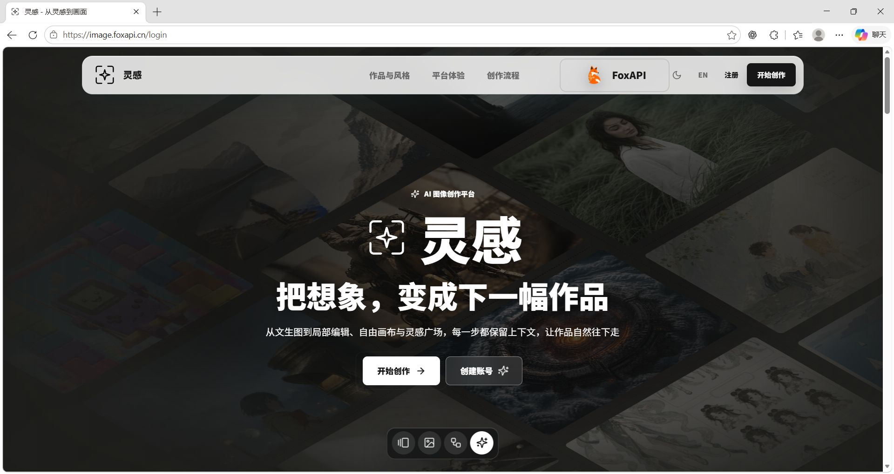</a>
</p>

<a id="why-linggan"></a>

## AI makes generation fast. Linggan keeps creation from breaking apart.

Making an image is no longer the hard part. The hard part is carrying a vague idea through to a coherent deliverable: reference images, prompts, rounds of outputs, local changes, alternative directions, and final files usually end up scattered across chats, drives, and separate tools. Every revision feels like a restart.

Linggan treats a **creative project**, not a one-off prompt, as the unit of work. Direction has a source. Assets keep their context. Edits have branches. The final work remains previewable, adjustable, and exportable. You always know where an image came from and where it can go next.

> **Start with an idea. Preserve the decisions worth keeping. Deliver work that stays editable.**

<a id="workflow"></a>

## One creative path, from intent to delivery

| 01 · Frame the direction | 02 · Build the visual language | 03 · Compose and iterate | 04 · Deliver the story |
| --- | --- | --- | --- |
| Start with a brief, source material, a reference, or a previous work; decide what needs to be communicated. | Generate images, derive prompts, and edit locally to build assets that can actually be used. | Connect materials, parameters, results, and alternatives on a canvas so exploration stays visible. | Shape the work into a poster, scientific figure, or presentation; refine, inspect, and export at the end. |

<p align="center">
  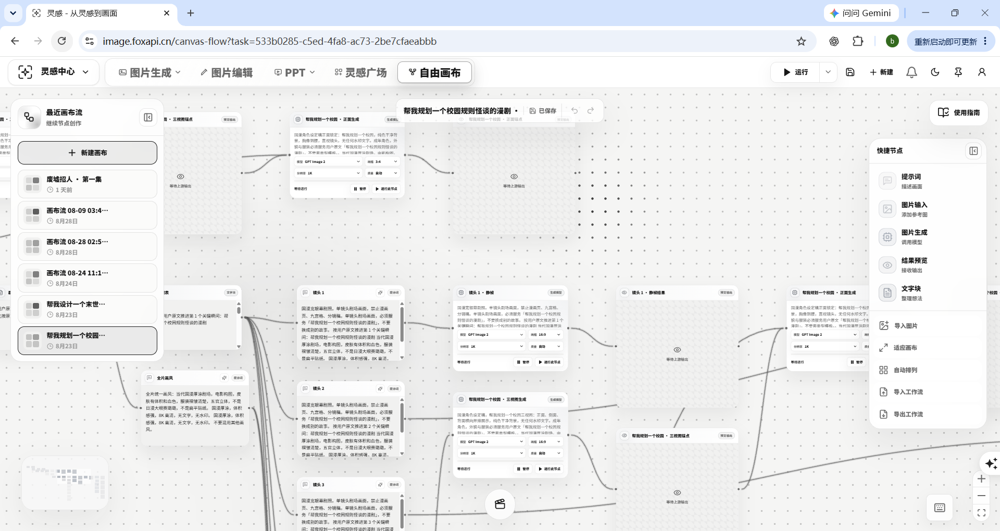
</p>

<p align="center">
  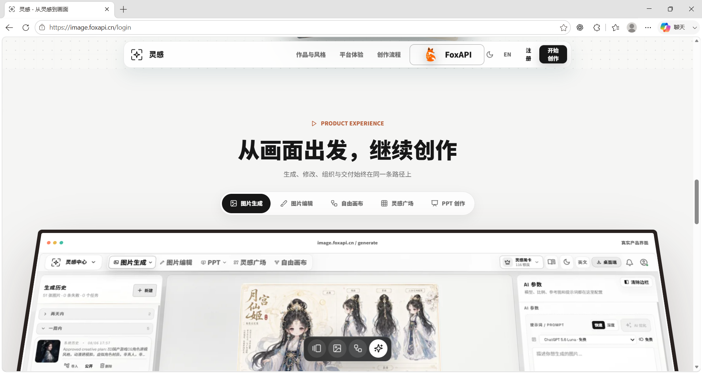
</p>

<a id="use-cases"></a>

## Made for work that needs to say something clearly

| Brand and content | Exploration and collaboration | Scientific communication | Reporting and presentation |
| --- | --- | --- | --- |
| Turn visual direction, references, and many rounds of generation into content assets that can keep evolving. | Preserve thinking, compare options, and keep key decisions on a canvas so discussion happens around the work itself. | Translate research intent into mechanism diagrams, workflows, graphical abstracts, and multi-panel figures. | Agree on the story first, then generate, preview, revise, and export an editable slide deck. |

Linggan is not a collection of unrelated generation entry points. It is built around continuity of intent: a reference can become a prompt, a generation task, a canvas node, and a presentation asset; an edit can remain the starting point of the next decision.

<a id="capabilities"></a>

## The experiences that make the system useful

### Turn outputs into reusable assets

Configure a model, ratio, dimensions, references, and prompt in one workspace. Text-to-image and image-to-image results do not stop as disposable chat attachments: they can move into editing, a canvas, the next generation, or a formal delivery flow while retaining their creative origin.

<p align="center">
  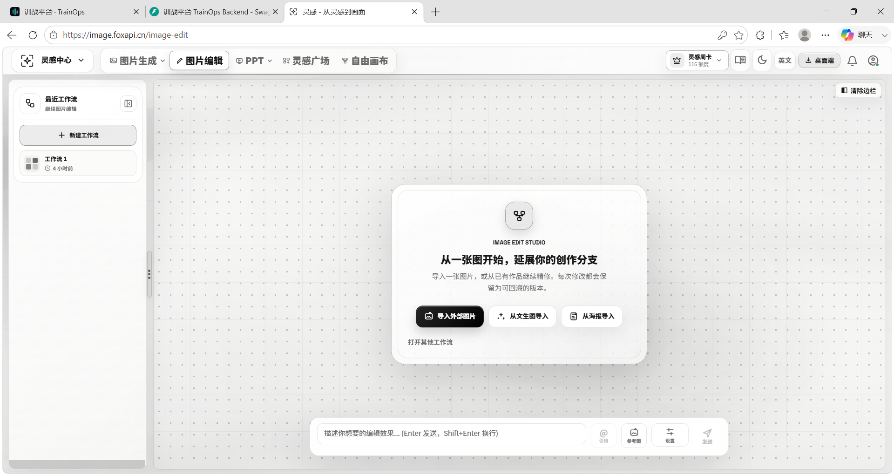
</p>

### Give every revision a place in the story

Start from an imported image, a generated result, or existing source material, then continue with inpainting, erasing, replacement, outpainting, region-based edits, and new generations. Linggan keeps source and branch relationships, so exploring another direction does not mean overwriting the one you already understood.

<p align="center">
  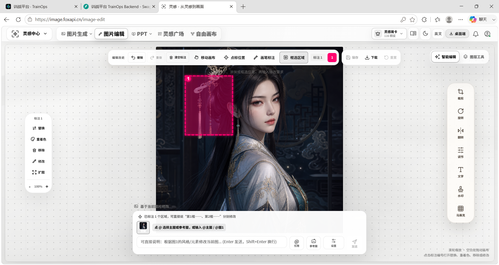
</p>

### Make “I like this” become “I know how to make it”

The inspiration gallery holds works, parameters, tags, and transferable creative recipes. Image-to-prompt examines a reference through subject, composition, camera, lighting, material, colour, and typography-safe areas. Inspiration is not just saved—it can be understood, rewritten, and taken into a new project.

<table>
  <tr>
    <td width="50%">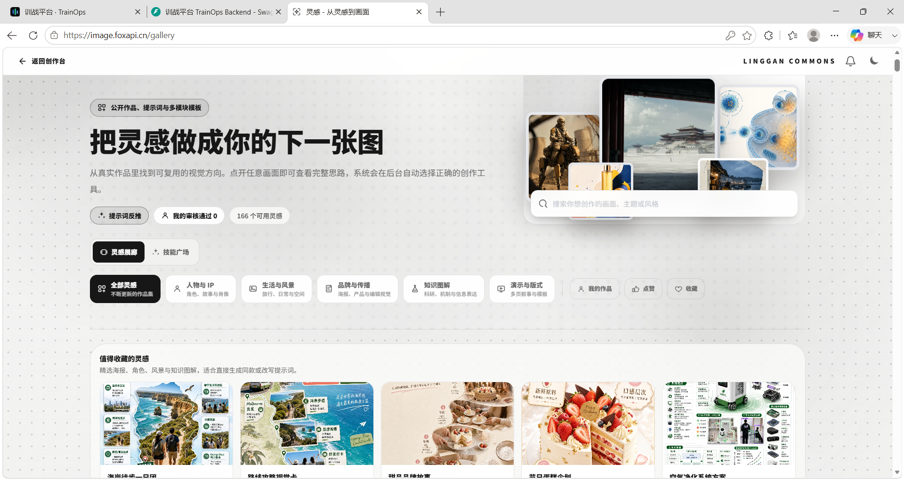</td>
    <td width="50%">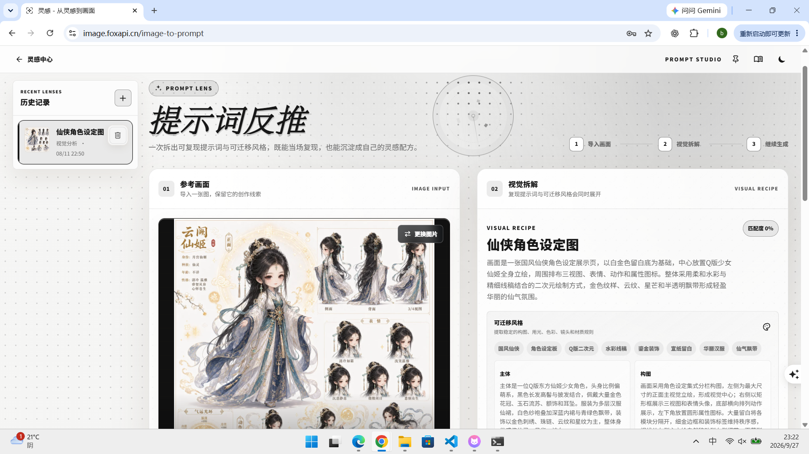</td>
  </tr>
  <tr>
    <td align="center"><b>Find a visual direction worth reusing</b><br />Discover a next move through works, tags, and recipes.</td>
    <td align="center"><b>Turn a reference into editable language</b><br />Understand an image instead of mechanically reproducing it.</td>
  </tr>
</table>

<p align="center">
  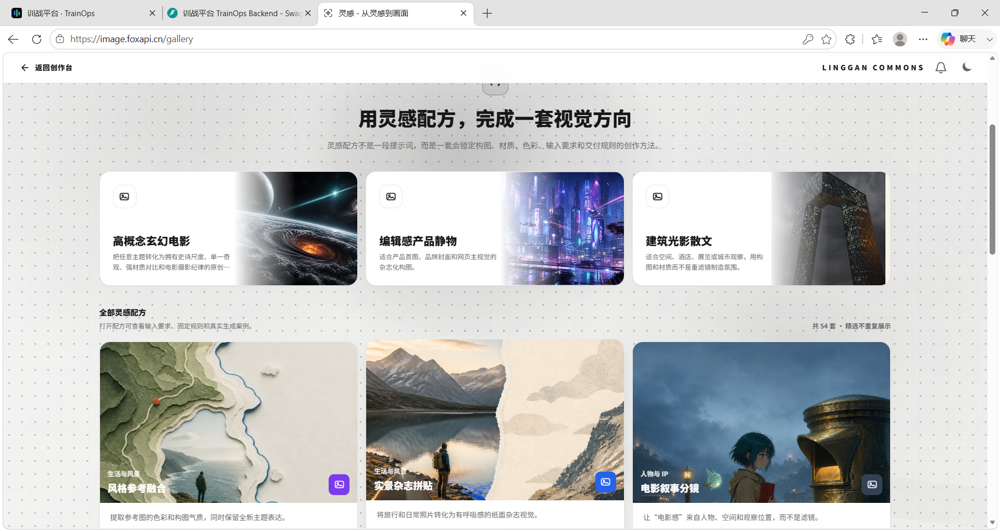
</p>

### See complex creative work in one canvas

The freeform canvas puts prompts, references, generation nodes, result previews, and notes in the same space. Connect inputs to outputs, preserve branches, and arrange nodes automatically. It is a live creative context—not a gallery board after the work is done.

<p align="center">
  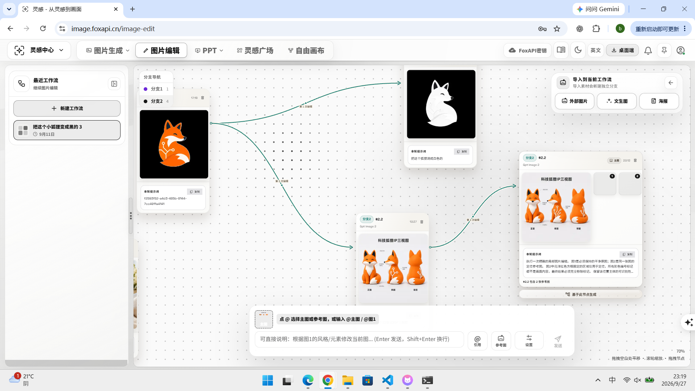
</p>

### Keep control through final delivery

The conversational PPT flow creates an editable outline first, then moves slide by slide after the story is confirmed. Scientific figure creation supports mechanism diagrams, experimental workflows, graphical abstracts, multi-panel paper figures, and research covers. Both flows keep preview, revision, and export before the final mile instead of treating an uncontrollable draft as the finished work.

<table>
  <tr>
    <td width="50%">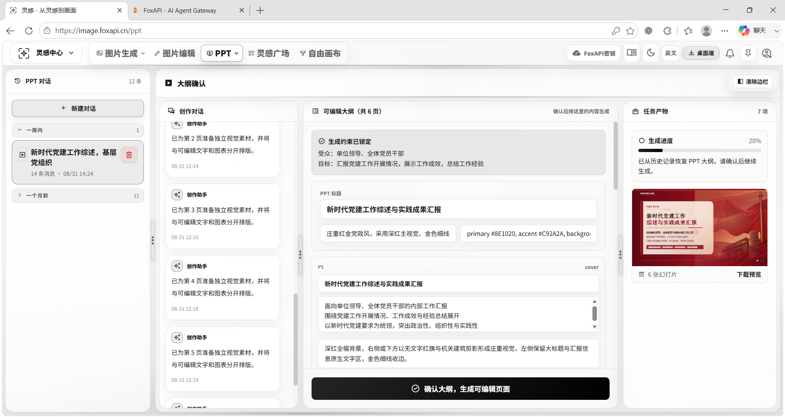</td>
    <td width="50%">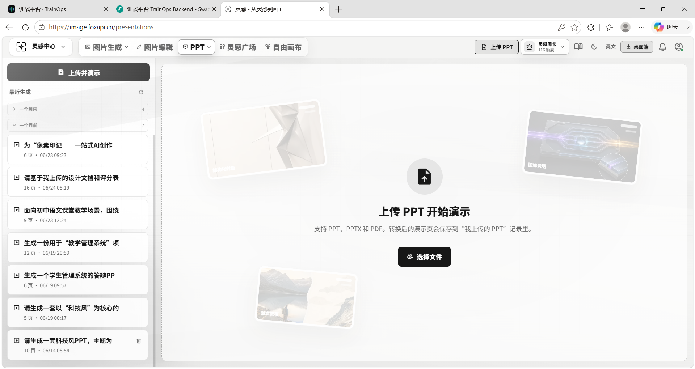</td>
  </tr>
  <tr>
    <td align="center"><b>Set the structure before producing pages</b><br />Use the outline as an intermediate artefact people can discuss and revise.</td>
    <td align="center"><b>Make generation serve the narrative</b><br />Preview, edit, and export slide by slide instead of pouring text into a template.</td>
  </tr>
  <tr>
    <td width="50%">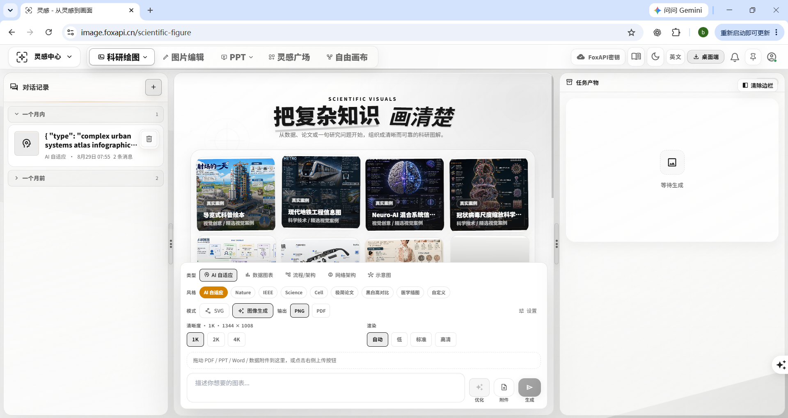</td>
    <td width="50%">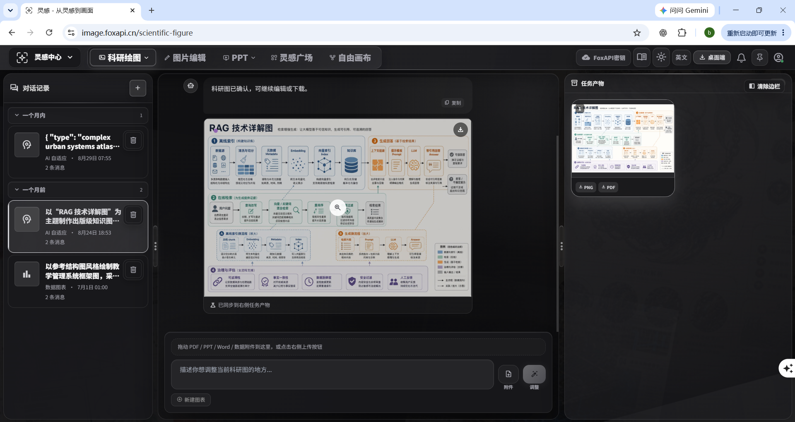</td>
  </tr>
  <tr>
    <td align="center"><b>Translate research intent into a visual draft</b><br />Create graphical abstracts, mechanism diagrams, workflows, and multi-panel figures.</td>
    <td align="center"><b>Refine before the work leaves your hands</b><br />Adjust, inspect, and export PNG or PDF.</td>
  </tr>
</table>

<a id="product-system"></a>

## A product system for work that keeps evolving

| Layer | What Linggan provides |
| --- | --- |
| **Creation** | Image generation and editing, image-to-prompt, freeform canvas, inspiration discovery, scientific figures, and presentations. |
| **Assets** | Creation history, material reuse, source tracking, task state, and traceable branches. |
| **Delivery** | Preview, revision, export, and visual, document, and presentation outputs ready for formal communication. |
| **Operations** | User, model catalogue, task, and content-review capabilities for operating the product. |

Model capabilities are connected through an adapter layer. An instance can combine its own model services, object storage, and product constraints without letting any single provider dictate the creation experience.

### Make a complex product learnable by design

The built-in learning centre turns core actions—creation entry points, history and deliverables, model access, and account controls—into followable task paths. It helps a first-time user understand how the system connects and gives a team a shared way to begin creating.

<p align="center">
  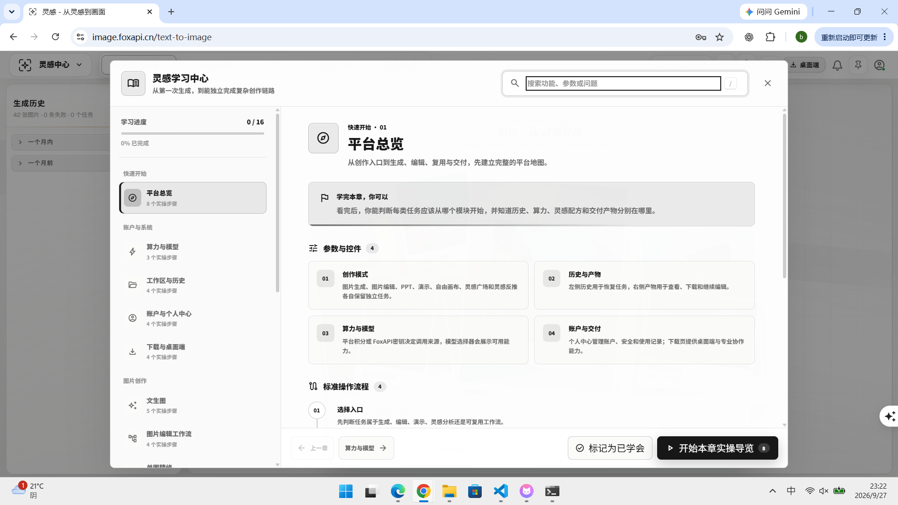
</p>

<a id="quick-start"></a>

## Quick start

### Prerequisites

- Node.js 20+
- Python 3.11+
- PostgreSQL 15+
- Redis 7+
- Object storage and compatible model APIs configured for your deployment

### 1. Start the API and task runner

```bash
git clone https://github.com/mengboxin/linggan.git
cd linggan

# macOS / Linux
cp backend/.env.example backend/.env

# Windows PowerShell
# Copy-Item backend/.env.example backend/.env

cd backend
pip install -r requirements.txt
```

Set the database, Redis, administrator, model-service, and object-storage values in `backend/.env`. For a new database, run:

```bash
psql "$DATABASE_URL" -v ON_ERROR_STOP=1 -f scripts/init_db.sql
python scripts/run_migrate.py
```

Start the API with the local development worker:

```bash
# macOS / Linux
START_EMBEDDED_WORKER=true uvicorn main:app --reload --port 8000

# Windows PowerShell
# $env:START_EMBEDDED_WORKER = "true"
# uvicorn main:app --reload --port 8000
```

> Run one worker mode per local environment: either `START_EMBEDDED_WORKER=true` or a standalone `python worker_main.py`.

### 2. Start the web app and admin console

```bash
# Terminal 2: web app, default http://127.0.0.1:5173
cd frontend
npm install
npm run dev

# Terminal 3: admin console, default http://127.0.0.1:5174
cd admin
npm install
npm run dev
```

<a id="architecture"></a>

## Architecture

```text
┌──────────────────────────────────────────────────────────────┐
│ React + TypeScript + Vite                                     │
│ User app: create · edit · canvas · inspiration · science · PPT│
│ Admin: users · models · tasks · content operations            │
└────────────────────────────┬─────────────────────────────────┘
                             │ HTTP / WebSocket
┌────────────────────────────▼─────────────────────────────────┐
│ FastAPI                                                       │
│ Auth · assets · model adapters · orchestration · delivery     │
└─────────────────┬────────────────────────────┬───────────────┘
                  │                            │
       ┌──────────▼──────────┐      ┌──────────▼──────────┐
       │ PostgreSQL + Redis  │      │ Async workers        │
       │ Data, sessions, queue│     │ Generate, render, export │
       └─────────────────────┘      └─────────────────────┘
                  │
       ┌──────────▼──────────┐
       │ Compatible APIs / S3│
       │ Images, previews, deliverables │
       └─────────────────────┘
```

| Directory | Purpose |
| --- | --- |
| `frontend/` | User-facing React app: creation, editing, canvas, gallery, PPT, and scientific figures. |
| `admin/` | Operations console. |
| `backend/` | FastAPI API, authentication, assets, model adapters, asynchronous tasks, and product logic. |
| `backend/migrations/` | Database migrations. |
| `backend/scripts/` | Initialisation, migration, and maintenance scripts. |

<a id="community"></a>

## Help shape the next version

Linggan does not need generic applause as much as it needs judgement from real creative work. Designers, researchers, content teams, and builders of AI creation tools are all welcome here.

- [Report a bug](https://github.com/mengboxin/linggan/issues/new/choose): include reproduction steps, expected behaviour, and useful screenshots.
- [Propose an idea](https://github.com/mengboxin/linggan/issues/new/choose): tell us about the workflow, friction, and ideal deliverable—not only the feature name.
- [Contribute code](./CONTRIBUTING.md): begin with a focused fix, interaction improvement, model adapter, or documentation update.

### Join the community

Scan the QR code to join the **Linggan AI Creation Community**, or search QQ group: **432142734**.

<p align="center">
  
</p>

Before opening a pull request, run:

```bash
npm --prefix frontend run lint
npm --prefix frontend run test
npm --prefix frontend run build
npm --prefix admin run build
```

## License

Released under the [MIT License](./LICENSE). Third-party components, model services, and creative media remain subject to their respective licences and terms.
